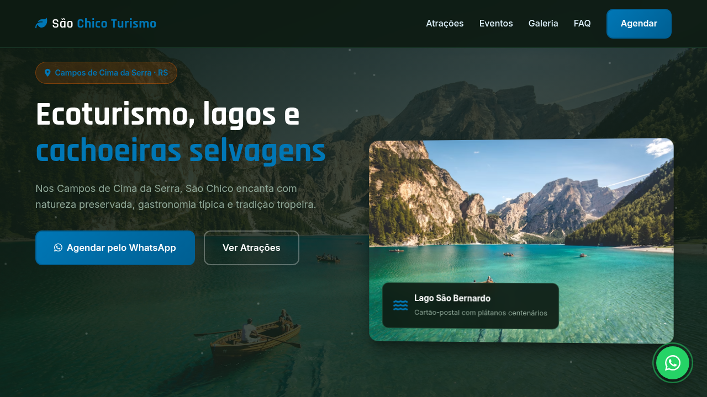
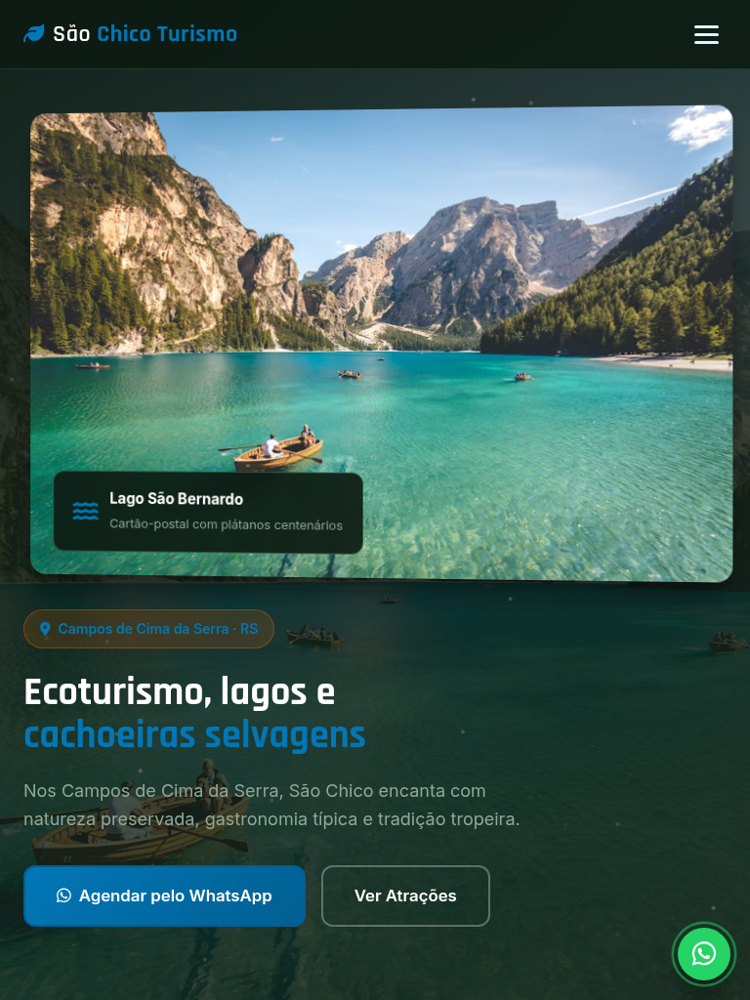
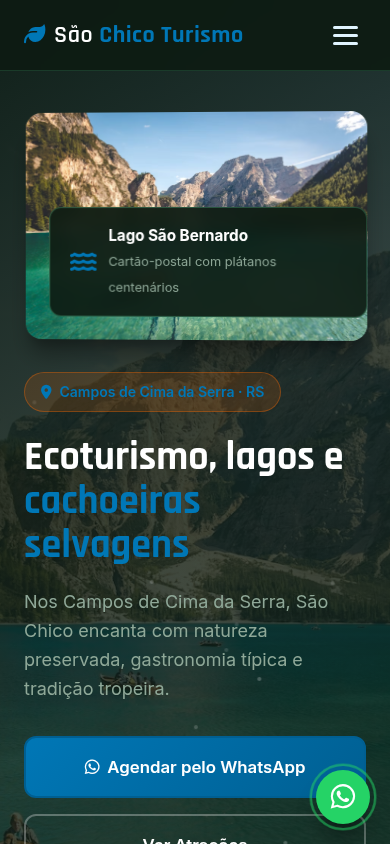

# São Francisco de Paula — Landing Page de Turismo

Landing page de alta conversão para turismo em **São Francisco de Paula** (Campos de Cima da Serra · RS), com atrações autênticas, eventos locais, galeria visual e agendamento estruturado via WhatsApp.

[](https://tofariasti.github.io/turismo-sao-francisco-de-paula/)

## Demo

**Moldura (preview):** [https://tofariasti.github.io/turismo-sao-francisco-de-paula/](https://tofariasti.github.io/turismo-sao-francisco-de-paula/)

**Tela cheia:** [https://tofariasti.github.io/turismo-sao-francisco-de-paula/site/](https://tofariasti.github.io/turismo-sao-francisco-de-paula/site/)

## Screenshots

### Desktop (1280px)


### Tablet (768px)


### Mobile (390px)


## Funcionalidades

- Design responsivo mobile-first com identidade visual regional
- Integração WhatsApp com formulário para agendar visita (nome, data, pessoas, roteiro)
- Animações AOS, partículas no hero, contadores e hover nos cards
- Seções: Hero, Como funciona, Atrações, Eventos, Galeria, FAQ e Contato
- Botão flutuante WhatsApp com pulse
- Acessibilidade: skip link, ARIA, contraste, foco visível, alt text
- Respeita `prefers-reduced-motion`
- Moldura iframe com preview desktop/tablet/mobile

## Pontos turísticos destacados

- **Lago São Bernardo** — Cartão-postal com 1,9 km de extensão, plátanos e esportes aquáticos gratuitos.
- **Mátria Parque de Flores** — Maior parque de flores das Américas — jardins botânicos a céu aberto.
- **Parque das 8 Cachoeiras** — Oito quedas d'água com trilhas de nível fácil a difícil — até 100 m de altura.
- **Ponte do Passo do Inferno** — Mirante sobre cachoeira com paisagem de tirar o fôlego na divisa com Canela.
- **Castelo MontSalvat** — Castelo de inspiração celta com arquitetura única — visitação e eventos.
- **Livraria Miragem** — Livraria encantadora no centro — parada cultural imperdível.

## Eventos

- **Festa do Pinhão** (Mar–Abr) — Gastronomia com pinhão, shows e cultura local — tradição serrana.
- **Paralelo Festival** (Jan) — Festival multicultural com artistas nacionais e internacionais.
- **Outono nos Plátanos** (Out) — Temporada fotogênica às margens do Lago São Bernardo.
- **Turismo rural e ecoturismo** (Ano todo) — Fazendas, trilhas e experiências de agroecologia na região.

## Tecnologias

- HTML5 semântico · CSS3 · JavaScript vanilla
- AOS 2.3.4 · Font Awesome 6.4 · Google Fonts (Rajdhani + Inter)

## Screenshots (geração)

```bash
python3 -m http.server 8765
npm install
npm run screenshots
```

## Repositório

https://github.com/tofariasti/turismo-sao-francisco-de-paula

## Autor

**Tiago O. de Farias** — [Farias Digital](https://fariasdigital.com.br/)

---

<p align="center">
  <a href="https://tofariasti.github.io/turismo-sao-francisco-de-paula/">🌐 Demo Online</a> ·
  <a href="https://fariasdigital.com.br/">🏢 Site Comercial</a>
</p>
